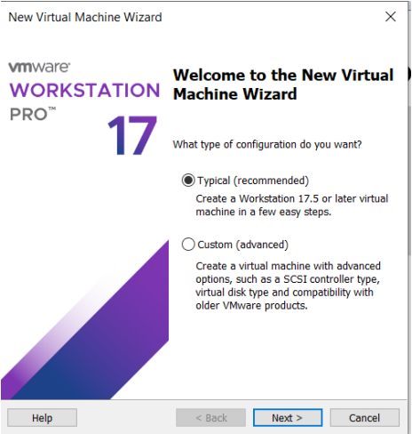
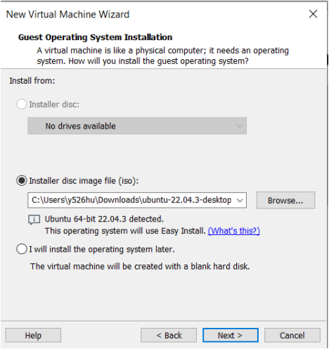
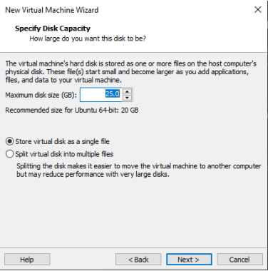
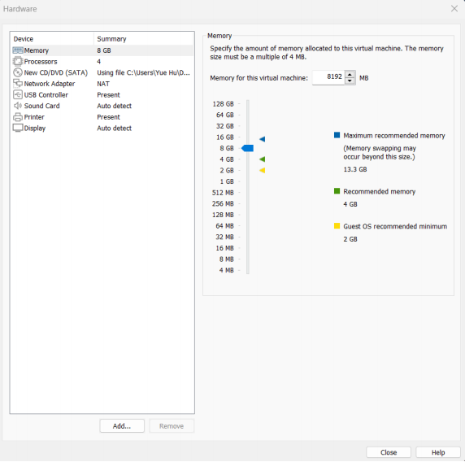
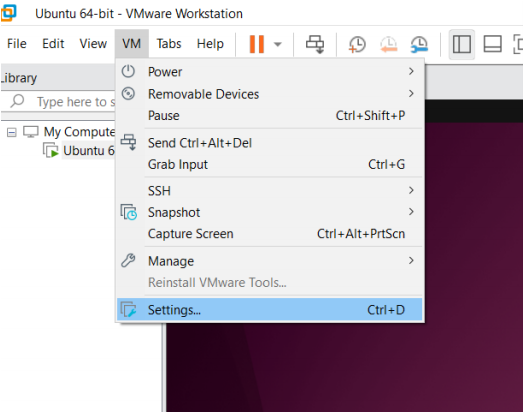
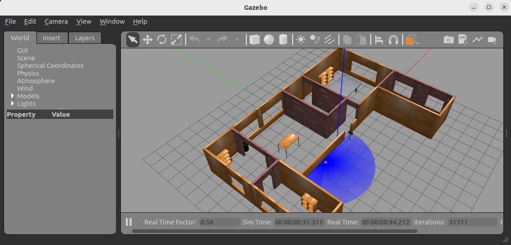

# ME597 - Autonomous Mobile Robots - Setup

## Install pre-requisites of the course for x86_64 systems
If you have not installed Ubuntu 22.04 yet, please do that first, please note this section is for **Windows x86_64** systems. If you are using MacOS with apple silicon, please skip this section and go to the next section.
#### Install Ubuntu22.04 as a Virtual Machine
##### Minimum System Requirements Recommended:
1.Diskspace:40GB
2.RAM:8-16 GB
3.CPU @ least 10 GHz in total (~ 4 cores)

##### Virtual Machine Instructions:
1. Download [Ubuntu 22.04 Desktop AMD64](https://releases.ubuntu.com/jammy/ubuntu-22.04.5-desktop-amd64.iso).
2. Download [VMWare Workstation 17](https://uofwaterloo-my.sharepoint.com/:u:/g/personal/m3ning_uwaterloo_ca/EYJ_HOFWwVZDp08AP8_M--EB3E3R30MSqH53rXgQJeGu2A?e=umutFn), this program was uploaded to UWaterloo's SharePoint, you will need to log in with your UWaterloo credentials to download it.
3. Run the downloaded VMware installer.
4. Follow the setup wizard and keep the default settings.
5. Run VMware and keep the default settings, select “Use VMware Workstation 17 for Personal Use”.
6. Choose “Create a New Virtual Machine” as shown below:
    
7. Select “Browse” and choose the directory for the Ubuntu discimage you have just downloaded:
    
8. Select “Next” and follow the Wizard instructions until you reach “Specify Disk Capacity”.
9. As shown below, changes the settings under “Specify Disk Capacity” to be:
    I. 30 (or more if you wish) in “Maximum disk size (GB)” instead of 25.
    II. “Store virtual disk as a single file” for the virtual disk setting instead of multiple files.
    
10. Select “Next”, you will see a summary of your settings. Click on “Customize Hardware…”. The window below will open. Here you can select computational resources you want to reserve to your virtual machine. It is recommended to provide at least 4GB of RAM (8 if possible, depending on your host machine, you can see on the window the recommendations by VMWare based on the host machine), and 2 processor cores (4 if possible, depending on host machine, do not use all or more cores than your host has). You can also change these settings after the VM is created if you needto increase or decrease.
    
11. Close the Customize Hardware window, and then click on“Finish”.
12. VMware should open and Ubuntu installation will start automatically.This step will take some time.
13. Enter your password.
14. Follow the setup, you should not need to change any default setting.
15. Make sure the host machine has internet access.
16. Go to VMware settings: Click “VM” at the top left and choose “Settings”, as shown below:
    
17. In the left menu, select “Network Adapter”. By default, NAT should be selected.
18. Make sure that under Device Status, you have ‘Connected’ and ‘Connected at power on’ both selected.
19. Surf the internet using Firefox. If you have internet, you have successfully configured the VMware network settings.
20. To make sure you installed everything correctly,open a terminal via press `Ctrl+Shift+T`, and run:
    ```
    sudo apt update && sudo apt install lsb-core lsb-release
    ```
21. Then run the following command to check the version of Ubuntu:
    ```
    lsb_release -a
    ```
22. You should see something like this:
    ```
    Distributor ID: Ubuntu
    Description: Ubuntu 22.04.4LTS
    Release: 22.04
    Codename:jammy
    ```
23. Finally, install git with `sudo apt install git` in a terminal.

#### Install ROS2
Download the script (or if you installed ```git```, clone this repository with ```git clone https://github.com/ME597c/ME597c-Students.git```, then change the branch to ```setup``` with ```git checkout setup```)

Run the script (it needs sudo privilege, so you will need to type in your password when prompted):
```
sh setup_mte544.sh
```
that will take care of installing everything you need for this course, including setting up some environmental variables.

## Install pre-requisites of the course for ARM64 systems
If you are using MacOS with apple silicon, the script above will not work. Please follow this blog [How to Set Up VMware, Ubuntu 22, ROS2, and Gazebo on Arm64 (like Apple Silicon or Jetson)](https://medium.com/@MinghaoNing/how-to-set-up-vmware-ubuntu-22-ros2-and-gazebo-on-arm64-like-apple-silicon-or-jetson-5bb4db6ff297) to set up your VM.

You can download the [VMWare for Mac](https://uofwaterloo-my.sharepoint.com/:u:/g/personal/m3ning_uwaterloo_ca/EcT9JtYERmdDgfo3bLKwcycBD9YJK1bTfYdmXHCT3Qe8Sw?e=ftKpPs) and the [Ubuntu 22.04 Desktop ARM64](https://uofwaterloo-my.sharepoint.com/:u:/g/personal/m3ning_uwaterloo_ca/EVgtqnAW51tKqpuYDOSf0vQB2sciaAPxsEJ6VpZDuztRsw?e=JJEYbZ) from the links provided.

## Check your installation
Once the script has finished the installation, you can quickly check the performance of your system with the Gazebo simulation. Open a terminal and run:
```
ros2 launch turtlebot3_gazebo turtlebot3_house.launch.py
```
You should see something like this:



At the bottom of the Gazebo window, you will see the ```Real Time Factor```, if this number is consistently below 0.5 (assuming you are not running anything else heavy on your VM or on your computer), this means that your simulation will likely be quite slow, and you may want to consider utilizing one of the alternative systems proposed (you may still use your system for code development and connecting with the real robot, just the testing in simulation might be slow).


## To check the latency of the topics in TurtleBot4s
NOTE: This part may be needed when you will be using the physical robot to check the latency in the communications.

Use the Latency check script like this:

```
./latency_check.py topic msgType
# for example for scan topic
./latency_check.py /scan LaserScan 
```


